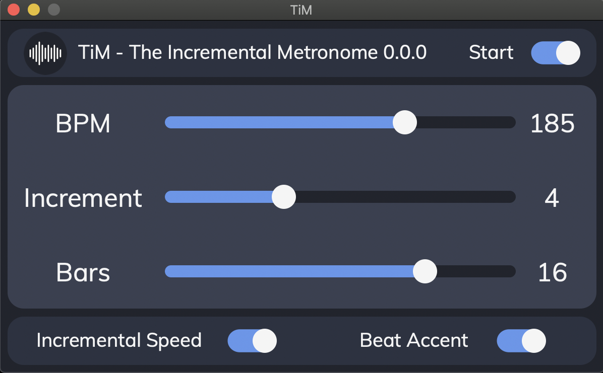

# TiM - The Incremental Metronome 

Simple and easy to use Metronome with customizable increasing speed.

## Features:
 * From 40 up to 250 BPM
 * Increase step from 1 to 10 BPM
 * Change speed after 4, 8, 16 or 20 bars

## Keyboard Shortcut:
 * SpaceBar --> to start/stop metronome
 * " + " --> to increase BPM (+1)
 * " - " --> to decrease BPM (-1)

## Pre-Compiled App:
 * In the folder you can download a pre-compiled version for macOS. 

## GUI

 
